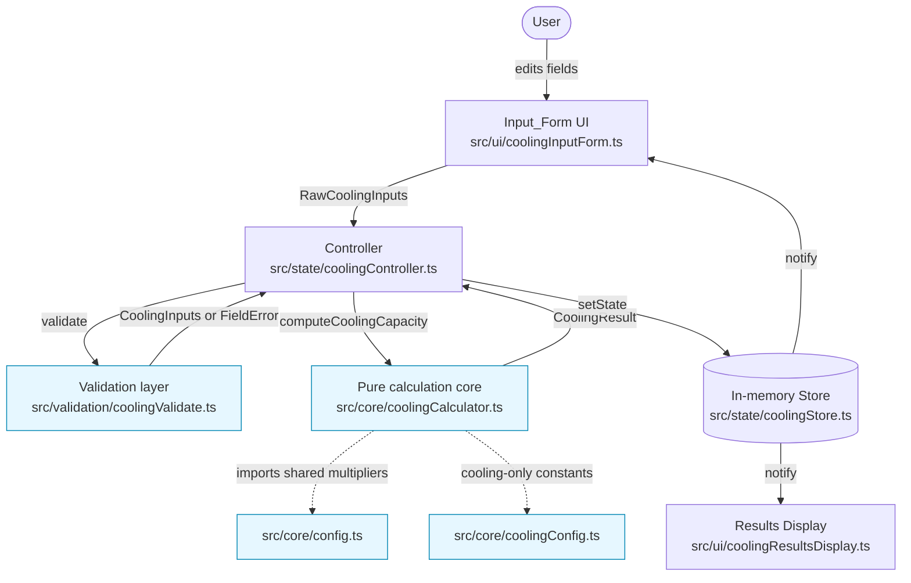

# Design Document

## Overview

The Air Conditioning Calculator is the cooling counterpart to the existing Radiator Heat Calculator. Where the heating calculator computes the heat that must be *added* to reach a warm indoor temperature against a cold outdoor design temperature, the cooling calculator computes the heat that must be *removed* to reach a cooler indoor temperature against a hot outdoor summer temperature, and then maps that required capacity onto a standard split-system ("external pump style") internal unit.

The feature is built to slot directly into the existing architecture without disturbing it:

- A **pure, deterministic calculation core** (`src/core/`) computes the cooling capacity from validated inputs, with no DOM, network, randomness, or time dependence (Requirement 8.2). This is what makes the core exhaustively unit- and property-testable, exactly like `computeHeatOutput`.
- A **pure validation layer** (`src/validation/`) mirrors `validateInputs`: it validates every field independently, collects all failures at once, and only yields a parsed input payload when every field passes (Requirements 1.3, 1.5, 2.6, 3.5, 3.6, 4.7, 4.8).
- An **in-memory state store + controller** (`src/state/`) drive the reactive validate → calculate → render-via-state pipeline (Requirements 5.5, 7.5, 8.4).
- **DOM-facing UI components** (`src/ui/`) render the input form and the results, updating in place with no page reload (Requirements 8.4, 8.5, 8.6).

The cooling feature deliberately **reuses the shared room-geometry and room-characteristic inputs, their ranges, and their documented multiplier values** from the heating calculator (Requirement 8.3): room dimensions, `Room_Type`, `Insulation_Level`, `External_Wall_Count`, and `Window_Type` share the same option sets, validation bounds, and multiplier tables (`INSULATION_MULTIPLIER`, `WINDOW_MULTIPLIER`, `WALL_MULTIPLIER`, `ROOM_TYPE_MULTIPLIER`) that already exist in `src/core/config.ts`. The cooling feature adds only what heating ignores: a hot outdoor summer temperature, solar heat gain (`Sun_Exposure`), and internal heat gains (`Occupant_Count`, `Appliance_Heat_Gain`).

### Design Decisions and Rationale

- **Separate cooling modules rather than overloading the heating ones.** The heating core (`calculator.ts`, `validate.ts`, `controller.ts`) is kept untouched; cooling logic lives in parallel modules (e.g. `coolingCalculator.ts`, `coolingConfig.ts`, `coolingValidate.ts`). This preserves the heating calculator's tested behaviour while allowing the two to share the common multiplier constants by importing them from the existing `config.ts`. Rationale: minimise regression risk and honour Requirement 8.3's "reuse shared values" without coupling the two calculators' distinct formulas.
- **Additive load model (envelope + internal gains).** Cooling load is naturally decomposed into heat entering through the room envelope and heat generated inside the room. Modelling `Cooling_Capacity = Envelope_Load + Internal_Gain_Load` matches Requirement 5's structure directly and makes the monotonicity properties (5.6, 5.7) fall out of the formula's shape.
- **`Effective_Delta_T_Cooling = max(Delta_T_Cooling, 0)`.** Clamping the temperature difference at zero (rather than the whole result) ensures the envelope contribution is never negative while still allowing internal gains to require cooling even when the outside is not hotter than the target (Requirements 3.8, 5.5).
- **TypeScript conventions.** Following the existing codebase, enumerations are modelled as string **union types** plus `Record`/`as const` lookup tables — never TypeScript `enum`s.
- **fast-check for property-based testing.** The core is pure and deterministic, so it is an ideal PBT target. The project already depends on `fast-check` and `vitest`; the cooling tests reuse that setup and the generator style from `calculator.test.ts`.

## Architecture

The feature adopts the same layered, unidirectional-data-flow architecture as the heating calculator. Raw string inputs flow from the form into the controller, which validates and (on success) calculates, writing derived state back into the store; the store notifies subscribers and the UI re-renders in place.



### Layer Responsibilities

| Layer | Module(s) | Purity | Responsibility |
|-------|-----------|--------|----------------|
| Domain types | `src/core/coolingTypes.ts` | Pure data | `SunExposure` union, `CoolingInputs`, `RawCoolingInputs`, `CoolingResult`, `UnitRecommendation` |
| Config | `src/core/coolingConfig.ts` (+ reuse of `config.ts`) | Pure | Cooling-only constants; re-exports/reuses shared multipliers |
| Calculation core | `src/core/coolingCalculator.ts` | Pure/deterministic | `computeCoolingVolume`, `computeDeltaTCooling`, `computeEnvelopeLoad`, `computeInternalGainLoad`, `computeCoolingWatts`, `wattsToBtu`, `wattsToKw`, `recommendUnit`, `computeCoolingCapacity` |
| Validation | `src/validation/coolingValidate.ts` | Pure | `validateCoolingInputs`: all-fields, collect-all-errors validation |
| State | `src/state/coolingStore.ts`, `src/state/coolingController.ts` | Pure of DOM | Hold state, run validate→calculate→state pipeline |
| UI | `src/ui/coolingInputForm.ts`, `src/ui/coolingResultsDisplay.ts` | DOM | Render controls & results in place |
| Composition | `src/main.ts` (extended) or `src/coolingMain.ts` | DOM | Wire layers, mount, initial render |

### Client-Side, No Backend, Static Deployment

All computation happens in the browser; the calculation core issues no network requests and needs no account or authentication (Requirement 8.1). The feature ships as part of the existing Vite static build (HTML/CSS/JS only), using relative asset paths configured for the GitHub Pages project subpath (`base` in `vite.config.ts`), and is published by the existing GitHub Actions workflow on pushes to the default branch (Requirement 9). No server-side runtime is introduced.

## Components and Interfaces

### Calculation Core (`src/core/coolingCalculator.ts`)

All functions are pure and deterministic. They accept already-validated numeric/union inputs so that edge cases (e.g. `Delta_T_Cooling <= 0`) are directly testable.

```typescript
/** Cooling volume = length x width x height, rounded to 2 dp (m^3). */
export function computeCoolingVolume(length: number, width: number, height: number): number;

/** Delta_T_Cooling = Outdoor_Summer_Temperature - Desired_Indoor_Temperature (C). */
export function computeDeltaTCooling(outdoorSummerC: number, desiredIndoorC: number): number;

/** Effective_Delta_T_Cooling = max(Delta_T_Cooling, 0). */
export function effectiveDeltaTCooling(deltaTCooling: number): number;

/** Envelope_Load in watts (uses effective delta-T and the room + sun multipliers). */
export function computeEnvelopeLoad(params: {
  volume: number;        // m^3, > 0
  deltaTCooling: number;  // C (may be <= 0; internally floored at 0)
  insulation: InsulationLevel;
  windowType: WindowType;
  externalWalls: number;  // 0..4
  roomType: RoomType;
  sunExposure: SunExposure;
}): number;

/** Internal_Gain_Load = occupantCount * HEAT_GAIN_PER_OCCUPANT + applianceHeatGain (W). */
export function computeInternalGainLoad(occupantCount: number, applianceHeatGain: number): number;

/** Cooling_Capacity in watts: round-half-up(envelope + internal), clamped to [0, 100000]. */
export function computeCoolingWatts(params: {
  volume: number;
  deltaTCooling: number;
  insulation: InsulationLevel;
  windowType: WindowType;
  externalWalls: number;
  roomType: RoomType;
  sunExposure: SunExposure;
  occupantCount: number;
  applianceHeatGain: number;
}): number;

/** Convert watts -> BTU/hr, round half-up (BTU_CONVERSION_FACTOR = 3.412142). */
export function wattsToBtu(watts: number): number;

/** Convert watts -> kilowatts (derived value for display). */
export function wattsToKw(watts: number): number;

/** Pick the smallest Nominal_Capacity (kW) >= capacity; flag when capacity exceeds the largest. */
export function recommendUnit(capacityWatts: number): UnitRecommendation;

/** Full pipeline: volume, delta-T, capacity (W/kW/BTU), and unit recommendation. */
export function computeCoolingCapacity(inputs: CoolingInputs): CoolingResult;
```

**The documented cooling formula** (Requirement 5.1, 5.2, 5.3):

```
Cooling_Volume            = round2dp(length * width * height)
Delta_T_Cooling           = Outdoor_Summer_Temperature - Desired_Indoor_Temperature
Effective_Delta_T_Cooling = max(Delta_T_Cooling, 0)

Envelope_Load  = Cooling_Volume
               * Effective_Delta_T_Cooling
               * COOLING_BASE_COEFFICIENT
               * INSULATION_MULTIPLIER[insulation]     // shared with heating
               * WINDOW_MULTIPLIER[windowType]         // shared with heating
               * WALL_MULTIPLIER[externalWalls]        // shared with heating
               * ROOM_TYPE_MULTIPLIER[roomType]        // shared with heating
               * SUN_EXPOSURE_MULTIPLIER[sunExposure]  // cooling-specific

Internal_Gain_Load = occupantCount * HEAT_GAIN_PER_OCCUPANT + applianceHeatGain

Cooling_Capacity_W = clamp(roundHalfUp(Envelope_Load + Internal_Gain_Load), 0, 100000)
Cooling_Capacity_kW  = Cooling_Capacity_W / 1000
Cooling_Capacity_BTU = roundHalfUp(Cooling_Capacity_W * BTU_CONVERSION_FACTOR)
```

`roundHalfUp` and `clamp` mirror the private helpers already used in `calculator.ts` (`Math.round` gives half-up rounding; clamp bounds to `[0, 100000]`).

**Unit recommendation** (Requirement 6): given the ascending `NOMINAL_CAPACITIES_KW` set, `recommendUnit` selects the smallest nominal value whose watt-equivalent (`nominalKw * 1000`) is `>=` the computed capacity. If the capacity exceeds the largest nominal value, it returns the largest value with `exceedsLargest: true` (Requirement 6.3).

### Validation Layer (`src/validation/coolingValidate.ts`)

`validateCoolingInputs(raw: RawCoolingInputs): CoolingValidationResult` reuses the strict-decimal matcher, decimal-place counting, and per-field/collect-all-errors discipline from `validate.ts`. It validates:

- **Dimensions** length/width/height: numeric, `0 < v <= 30`, `<= 2 dp` (Requirements 1.2, 1.3, 1.5) — identical bounds to heating (shared, Requirement 8.3).
- **Room characteristics**: `Room_Type`, `Insulation_Level`, `Window_Type` enum membership; `External_Wall_Count` whole number `0..4` (Requirements 2.1–2.4, 2.6).
- **Temperatures**: `Outdoor_Summer_Temperature` numeric `20.0..50.0`, `<= 1 dp` (Requirements 3.1, 3.5); `Desired_Indoor_Temperature` numeric `16.0..30.0`, `<= 1 dp` (Requirements 3.2, 3.6).
- **Cooling gains**: `Sun_Exposure` enum membership (Requirement 4.1); `Occupant_Count` whole number `0..20` (Requirements 4.2, 4.7); `Appliance_Heat_Gain` whole number `0..10000` (Requirements 4.3, 4.8).

On any failure it returns `{ valid: false, errors }` with no `inputs` payload, so no capacity is computed (Requirement 5.8). On success it returns `{ valid: true, errors: [], inputs }`.

### State (`src/state/coolingStore.ts`, `coolingController.ts`)

The store mirrors the heating store: it holds `RawCoolingInputs`, the last valid `CoolingResult | null`, current `FieldError[]`, and a `resultUnavailable` flag (Requirement 8.6). The controller's `handleInputChange(raw)`:

1. Always persists the latest raw inputs (so entered values are retained — Requirements 3.5, 3.6, 8.5).
2. On validation failure: writes all `FieldError`s, clears the result to `null` (placeholder), clears `resultUnavailable` (Requirements 5.8, 7.7).
3. On validation success: calls `computeCoolingCapacity` inside `try/catch`. Success → store result, clear errors/flag. Thrown error → keep inputs, clear result, set `resultUnavailable = true`, do **not** rethrow (Requirement 8.6).

### UI (`src/ui/coolingInputForm.ts`, `coolingResultsDisplay.ts`)

- **Input form** renders all controls with unit labels (Requirements 1.1, 2.1–2.4, 3.1, 3.2, 4.1–4.3), seeds documented defaults on unchanged controls (Requirements 2.5, 3.3, 3.4, 4.4, 4.5, 4.6), emits raw inputs on every change without reload (Requirement 8.4), and renders per-field validation messages beside the offending control (Requirements 1.3, 1.5). It re-renders in place via a `WeakMap` instance cache to preserve focus, as the heating form does.
- **Results display** shows the watts (`W`), kilowatts (`kW`), BTU/hr (`BTU/hr`), and recommended `Nominal_Capacity` values concurrently, each unit-labelled (Requirement 7.4). It shows a placeholder (`--`) for every value when there is no valid result (initial load or invalid input — Requirements 7.6, 7.7) and an "exceeds a single standard unit" note when applicable (Requirement 6.3). A distinct "result unavailable" message covers calculation failure (Requirement 8.6).

## Data Models

Following the existing convention, enumerations are string **union types** with `Record`/`as const` lookup tables (no TS `enum`s). Shared types (`RoomType`, `InsulationLevel`, `WindowType`, `FieldError`) are imported from `src/core/types.ts`.

```typescript
// src/core/coolingTypes.ts

import type { RoomType, InsulationLevel, WindowType, FieldError } from './types';

/** Classification of direct solar heat gain the room receives. */
export type SunExposure = 'Shaded' | 'Average' | 'Sunny';

/** Raw inputs as read from the form, before validation (all strings). */
export interface RawCoolingInputs {
  length: string;
  width: string;
  height: string;
  outdoorSummerTemp: string;
  desiredIndoorTemp: string;
  roomType: string;
  insulation: string;
  windowType: string;
  externalWalls: string;
  sunExposure: string;
  occupantCount: string;
  applianceHeatGain: string;
}

/** Validated, parsed cooling inputs (only produced when every field is valid). */
export interface CoolingInputs {
  length: number;            // 0 < v <= 30, <= 2 dp
  width: number;             // 0 < v <= 30, <= 2 dp
  height: number;            // 0 < v <= 30, <= 2 dp
  outdoorSummerTempC: number; // 20.0..50.0, <= 1 dp
  desiredIndoorTempC: number; // 16.0..30.0, <= 1 dp
  roomType: RoomType;
  insulation: InsulationLevel;
  windowType: WindowType;
  externalWalls: number;     // integer 0..4
  sunExposure: SunExposure;
  occupantCount: number;     // integer 0..20
  applianceHeatGain: number; // integer 0..10000 (W)
}

/** Recommended standard split-system internal unit size. */
export interface UnitRecommendation {
  nominalKw: number;       // selected standard size (kW)
  exceedsLargest: boolean; // true when computed capacity exceeds the largest nominal
}

/** Result of a successful cooling-capacity calculation. */
export interface CoolingResult {
  volume: number;          // m^3, 2 dp
  deltaTCooling: number;    // C (may be <= 0)
  watts: number;           // integer, 0..100000
  kw: number;              // watts / 1000
  btu: number;             // integer BTU/hr
  recommendation: UnitRecommendation;
}

/** Validation result: parsed inputs on success, or the full error list. */
export interface CoolingValidationResult {
  valid: boolean;
  errors: FieldError[];
  inputs?: CoolingInputs; // present only when valid === true
}
```

```typescript
// src/core/coolingConfig.ts  (cooling-only constants; shared multipliers imported from ./config)

import type { SunExposure } from './coolingTypes';

/** Base volumetric cooling coefficient, W per m^3 per degree C. */
export const COOLING_BASE_COEFFICIENT = 1.0;

/** Sensible heat gain contributed by each occupant, in watts. */
export const HEAT_GAIN_PER_OCCUPANT = 100;

/** Multiplier applied for each Sun_Exposure classification. */
export const SUN_EXPOSURE_MULTIPLIER: Record<SunExposure, number> = {
  Shaded: 0.9,
  Average: 1.0,
  Sunny: 1.2,
};

/** Standard split-system nominal cooling sizes (kW), ascending (Requirement 6.1). */
export const NOMINAL_CAPACITIES_KW: readonly number[] = [2.0, 2.5, 3.5, 5.0, 7.1, 8.0, 10.0];

/** Documented defaults for unchanged cooling controls (Requirements 3.3, 3.4, 4.4-4.6). */
export const DEFAULT_OUTDOOR_SUMMER_TEMP_C = 35;   // within 20.0..50.0
export const DEFAULT_DESIRED_INDOOR_TEMP_C = 22;   // within 16.0..30.0
export const DEFAULT_SUN_EXPOSURE: SunExposure = 'Average';
export const DEFAULT_OCCUPANT_COUNT = 2;           // within 0..20
export const DEFAULT_APPLIANCE_HEAT_GAIN = 0;      // within 0..10000
```

The shared multiplier tables (`INSULATION_MULTIPLIER`, `WINDOW_MULTIPLIER`, `WALL_MULTIPLIER`, `ROOM_TYPE_MULTIPLIER`) and `BTU_CONVERSION_FACTOR` are imported from the existing `src/core/config.ts` (Requirement 8.3), keeping a single source of truth for values common to both calculators.


## Correctness Properties

*A property is a characteristic or behavior that should hold true across all valid executions of a system — essentially, a formal statement about what the system should do. Properties serve as the bridge between human-readable specifications and machine-verifiable correctness guarantees.*

The cooling calculation core is pure and deterministic, making it an ideal target for property-based testing (mirroring the existing `calculator.test.ts`). The following properties are derived from the acceptance criteria via the prework analysis. Each is validated by a single fast-check property test running at least 100 iterations.

### Property 1: Cooling volume is the rounded product of dimensions

*For any* valid length, width, and height (each `0 < v <= 30`, `<= 2 dp`), `computeCoolingVolume` returns `length * width * height` rounded to 2 decimal places.

**Validates: Requirements 1.4**

### Property 2: Delta_T_Cooling is outdoor minus indoor temperature

*For any* outdoor summer temperature and desired indoor temperature, `computeDeltaTCooling` returns exactly `outdoor - indoor`.

**Validates: Requirements 3.7**

### Property 3: Effective_Delta_T_Cooling is never negative

*For any* Delta_T_Cooling value (positive, zero, or negative), `effectiveDeltaTCooling` returns `max(deltaTCooling, 0)`, which is always `>= 0`.

**Validates: Requirements 3.8**

### Property 4: Internal_Gain_Load is the documented sum of gains

*For any* valid occupant count and appliance heat gain, `computeInternalGainLoad` returns `occupantCount * HEAT_GAIN_PER_OCCUPANT + applianceHeatGain`.

**Validates: Requirements 5.2**

### Property 5: Cooling capacity is bounded, whole-watt, and equals the documented formula

*For any* valid cooling inputs, the computed `Cooling_Capacity` in watts is an integer in `[0, 100000]` equal to `clamp(roundHalfUp(Envelope_Load + Internal_Gain_Load), 0, 100000)`, where `Envelope_Load` is the documented product of `Cooling_Volume`, `Effective_Delta_T_Cooling`, `COOLING_BASE_COEFFICIENT`, and the shared insulation/window/wall/room-type multipliers together with the `SUN_EXPOSURE_MULTIPLIER`.

**Validates: Requirements 5.1, 5.3**

### Property 6: Cooling calculation is deterministic

*For any* valid cooling inputs, computing the full `CoolingResult` (capacity values and unit recommendation) twice yields identical results.

**Validates: Requirements 5.4, 6.4, 8.2**

### Property 7: Zero-demand inputs yield zero capacity

*For any* valid inputs where `Delta_T_Cooling <= 0` AND `Occupant_Count == 0` AND `Appliance_Heat_Gain == 0`, the computed `Cooling_Capacity` in watts equals `0`.

**Validates: Requirements 5.5**

### Property 8: Capacity is monotonic non-decreasing in volume

*For any* valid inputs and any positive volume increment, holding all other inputs constant, the `Cooling_Capacity` computed at the larger volume is `>=` the capacity at the smaller volume.

**Validates: Requirements 5.6**

### Property 9: Capacity is monotonic non-decreasing in internal gains

*For any* valid inputs and any non-negative increase to `Occupant_Count` and/or `Appliance_Heat_Gain`, holding all other inputs constant, the resulting `Cooling_Capacity` is `>=` the previous `Cooling_Capacity`.

**Validates: Requirements 5.7**

### Property 10: Unit recommendation selects the smallest sufficient standard size

*For any* computed capacity, `recommendUnit` returns the smallest `Nominal_Capacity` whose watt-equivalent is `>=` the capacity; and *for any* capacity exceeding the largest nominal value, it returns the largest nominal value with `exceedsLargest === true`.

**Validates: Requirements 6.2, 6.3**

### Property 11: Watt-to-unit conversions are proportional and correctly rounded

*For any* watts value, `wattsToBtu` returns `roundHalfUp(watts * BTU_CONVERSION_FACTOR)` and `wattsToKw` returns `watts / 1000`.

**Validates: Requirements 7.2, 7.3**

### Property 12: Valid inputs are accepted and parsed

*For any* set of raw inputs where every field is within its documented range and precision (dimensions `0 < v <= 30` `<=2dp`; outdoor temp `20.0..50.0` `<=1dp`; indoor temp `16.0..30.0` `<=1dp`; walls integer `0..4`; occupants integer `0..20`; appliance integer `0..10000`; enums valid), `validateCoolingInputs` returns `valid === true` with a fully populated `CoolingInputs` payload.

**Validates: Requirements 1.2, 3.1, 3.2, 4.2, 4.3**

### Property 13: Out-of-range or malformed inputs are rejected with the offending field flagged

*For any* raw inputs containing a field that is empty, non-numeric, out of range, over-precise, or (for integer fields) non-integer, `validateCoolingInputs` returns `valid === false`, includes a `FieldError` naming that field, and omits the `inputs` payload so no capacity is computed.

**Validates: Requirements 1.3, 2.6, 3.5, 3.6, 4.7, 4.8, 5.8**

### Property 14: All invalid fields are reported simultaneously

*For any* raw inputs with two or more invalid fields, `validateCoolingInputs` returns a distinct `FieldError` for every invalid field in a single result.

**Validates: Requirements 1.5**

### Property 15: Results rendering shows every value with its unit label

*For any* `CoolingResult`, rendering the results display produces output containing the watts value labelled `W`, the kilowatts value labelled `kW`, the BTU/hr value labelled `BTU/hr`, and the recommended `Nominal_Capacity`, all shown concurrently.

**Validates: Requirements 7.4**

## Error Handling

The cooling feature uses the same three-tier error strategy as the heating calculator: prevent invalid computation via validation, surface field-level messages in place, and degrade gracefully if the calculation itself fails.

| Condition | Detection | Handling | Requirements |
|-----------|-----------|----------|--------------|
| Any field empty / non-numeric / out of range / over-precise | `validateCoolingInputs` (pure) | Collect all `FieldError`s, return `valid: false` with no `inputs`; controller clears result to `null` and surfaces messages beside each offending control; entered values retained | 1.3, 1.5, 2.6, 3.5, 3.6, 4.7, 4.8, 5.8, 8.5 |
| No valid result yet (initial load) | Store `result === null` | Results display shows `--` placeholder for every value | 7.6 |
| Input becomes invalid after a result was shown | Controller writes `result: null` on validation failure | Results display replaces all values with `--` placeholders | 7.7 |
| `Delta_T_Cooling <= 0` (outdoor not hotter than target) | `effectiveDeltaTCooling` floors envelope contribution at 0 | Envelope load is 0; capacity reflects only internal gains (or 0 if none) — a valid result, not an error | 3.8, 5.5 |
| Computed capacity exceeds largest standard unit | `recommendUnit` boundary check | Return largest nominal with `exceedsLargest: true`; UI notes required capacity exceeds a single standard unit | 6.3 |
| Calculation logic throws unexpectedly | `try/catch` in controller around `computeCoolingCapacity` | Keep inputs, clear result, set `resultUnavailable: true`, do not rethrow; UI still renders the form and shows a "result unavailable" indication | 8.6 |
| Missing mount containers | Composition root guard | Throw a descriptive error at bootstrap (developer-facing, before any user interaction) | — |

All error handling occurs client-side, in place, with no navigation or page reload, and never issues a network request (Requirements 8.1, 8.4, 8.5).

## Testing Strategy

The feature is tested with the project's existing stack — **Vitest** as the test runner and **fast-check** for property-based testing (`jsdom` for the DOM-facing components) — matching `calculator.test.ts`, `validate.test.ts`, and the UI tests already in the repository. No property-based testing framework is written from scratch.

### Property-Based Tests (pure core + validation)

- Each of the 15 correctness properties above is implemented as **exactly one** fast-check property test.
- Each property test runs a **minimum of 100 iterations** (the existing suite uses `NUM_RUNS = 200`; the cooling suite follows suit).
- Each test is tagged with a comment referencing its design property, using the format:
  `// Feature: air-conditioning-calculator, Property {number}: {property_text}`
- Reusable generators mirror `calculator.test.ts`: `dimensionArb` (integers `1..3000` mapped to `/100`), outdoor-temp arb (`200..500` `/10`), indoor-temp arb (`160..300` `/10`), `sunExposureArb = fc.constantFrom('Shaded','Average','Sunny')`, `occupantArb = fc.integer({min:0,max:20})`, `applianceArb = fc.integer({min:0,max:10000})`, plus the shared room-type/insulation/window/wall generators. A `coolingInputsArb` composes these into a valid `CoolingInputs`.
- For rejection/validation properties, generators produce deliberately out-of-range or malformed strings (empty, whitespace, non-numeric, over-precise, out-of-bounds, non-integer for integer fields).

### Unit / Example Tests

Focused example tests cover concrete behaviours and edge cases that are not universal properties:

- **Worked example vector**: one fully specified room → known volume, envelope load, internal gain, watts, kW, BTU/hr, and recommended unit (analogous to the heating worked example), guarding against constant drift.
- **Config sanity**: `NOMINAL_CAPACITIES_KW` is strictly ascending and non-empty (6.1); shared multiplier tables are imported from `config.ts` (8.3); cooling default constants are members of / within their option sets and ranges (2.5, 3.3, 3.4, 4.4, 4.5, 4.6).
- **Zero-demand boundary** (5.5): an explicit example with outdoor ≤ indoor, zero occupants, zero appliances → 0 W (in addition to Property 7).
- **UI presence** (1.1, 2.1–2.4, 3.1, 3.2, 4.1): render the form and assert every control exists with its labels/options/range attributes.
- **UI/controller behaviour** (5.8, 7.5, 7.6, 7.7, 8.4, 8.5, 8.6): drive the controller/store with valid→invalid transitions and a forced calculation throw; assert placeholders, value retention, in-place updates, and the "result unavailable" indication.

### Integration / Smoke Tests

- **No-network / purity smoke** (8.1, 8.2): assert the core and validation modules perform no network or DOM access.
- **Build smoke** (9.1, 9.2): the Vite production build succeeds and references assets via the configured GitHub Pages base path; served from the subpath, assets resolve without 404s.
- **Deployment** (9.3, 9.4): handled by the existing GitHub Actions workflow (`deploy.yml`) — a failed build halts before publish and preserves the live site; verified via CI status rather than property tests.

### Rationale for the Testing Split

Property-based tests target the pure, input-varying calculation and validation logic where 100+ generated inputs expose edge cases (rounding boundaries, clamping, monotonicity, precision limits). Example, UI, and integration tests cover fixed configuration, DOM interaction, error-recovery transitions, and deployment concerns where behaviour does not vary meaningfully with input and property-based testing would add no value.
