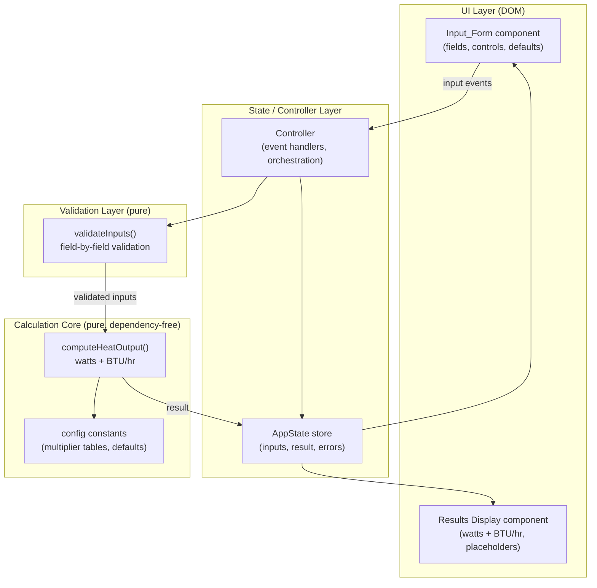
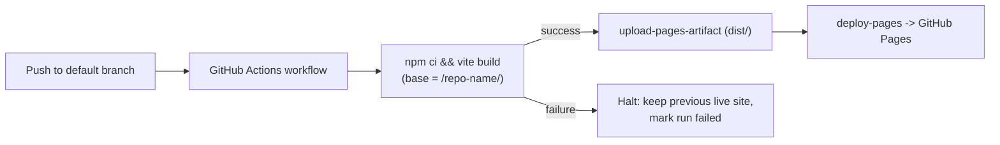

# Design Document

## Overview

The Radiator Heat Calculator is a client-side Single Page Application (SPA) that computes the heat output required to warm a room, presenting the result in both watts (W) and BTU/hr. The application is written in TypeScript, has no backend, and is deployed to GitHub Pages via an automated GitHub Actions workflow.

The design separates a **pure, dependency-free calculation core** from the **UI/state layer**. This separation is the central design decision: it keeps the physics/arithmetic logic deterministic and side-effect free so it can be exhaustively verified with unit tests and property-based tests, while the DOM-facing code handles rendering, event wiring, and validation feedback.

### Key Design Decisions

| Decision | Rationale |
| --- | --- |
| Vite + vanilla TypeScript | Fast static build, tiny bundle, first-class TS support, and a `base` config option that solves the GitHub Pages project-subpath asset-path problem. Avoids framework weight for a single-form app. |
| Pure calculation core module | Deterministic functions with explicit inputs/outputs are trivially unit- and property-testable, satisfying Requirement 4's determinism/monotonicity guarantees. |
| Delta_T-based volumetric heat-loss model | Produces a deterministic, monotonic, physically-motivated formula whose behavior matches every clause of Requirement 4. |
| `fast-check` for property-based testing | Mature, well-maintained PBT library for TypeScript; avoids hand-rolling generators. |
| In-place reactive re-render on input change | Satisfies the "no page reload / update in place" clauses (Requirements 5.4, 6.4). |

### Research Notes

- **UK domestic heating rule-of-thumb**: Domestic radiator sizing in the UK is commonly approached with a volumetric method — room volume multiplied by a heat-loss factor and adjusted for insulation, glazing, and exposed walls. A Delta_T against a cold outdoor design temperature (frequently taken as around -3 C in UK sizing guidance) is a standard basis. Content was rephrased for compliance with licensing restrictions.
- **Watt to BTU/hr conversion**: 1 watt = 3.412142 BTU/hr (standardised conversion constant used throughout the requirements).
- **GitHub Pages + Vite**: Project sites are served from a subpath (`https://<owner>.github.io/<repo>/`), so the build must set Vite's `base` to `/<repo>/` (or a relative base) so hashed asset URLs resolve without 404s. The official `actions/deploy-pages` flow builds and publishes the `dist/` artifact without manual uploads.

## Architecture

The application is organised into four layers. The calculation core has **no imports from the UI or DOM** and is pure.



### Data Flow

1. The user edits a field in the **Input_Form**. An input/change event fires.
2. The **Controller** reads the raw form values into the `AppState` store and invokes the **Validation Layer**.
3. If validation fails, per-field messages are written to state, the result is cleared to a placeholder, and the previously entered values are retained. No calculation runs.
4. If validation succeeds, the controller calls the **Calculation Core** with the parsed, validated inputs.
5. The core returns a `{ watts, btu }` result, which is stored and rendered by the **Results Display**.
6. All updates happen in place (no navigation or reload).

### Module Boundaries

- `src/core/` — pure calculation and configuration. No DOM, no `window`, no I/O.
- `src/validation/` — pure validation functions returning structured results. No DOM.
- `src/state/` — in-memory application state and a small subscribe/notify mechanism.
- `src/ui/` — DOM construction, event binding, rendering. The only layer that touches `document`.
- `src/main.ts` — composition root that wires the layers together and mounts the app.

## Components and Interfaces

### Input_Form (`src/ui/inputForm.ts`)

Responsible for rendering the form controls (Requirements 1, 2, 3) and emitting change events.

- Renders numeric fields for length, width, height (unit label: metres), desired indoor temperature (C).
- Renders selection controls for Room_Type, Insulation_Level, Window_Type, and a numeric control for External_Wall_Count (0-4).
- Applies documented defaults to unchanged controls (Requirement 2.5, 3.2).
- Tracks whether the desired-temperature field has been manually edited so a later Room_Type change does not overwrite a user-entered value (Requirement 3.3).
- Exposes:
  - `renderForm(container: HTMLElement, state: AppState, onChange: (raw: RawInputs) => void): void`
  - `applyRoomTypeDefaults(roomType: RoomType, tempManuallyEdited: boolean): { desiredTemp?: number }`

### Results Display (`src/ui/resultsDisplay.ts`)

Renders the computed result or a placeholder (Requirement 5).

- Shows watts labelled `W` and BTU/hr labelled `BTU/hr` concurrently (Requirement 5.3).
- Shows a placeholder (e.g. `--`) when no valid result exists or when inputs become invalid (Requirements 5.5, 5.6).
- Exposes: `renderResults(container: HTMLElement, result: HeatResult | null): void`

### Controller (`src/state/controller.ts`)

Orchestrates the validate -> calculate -> render pipeline on every input change.

- Exposes: `handleInputChange(raw: RawInputs): void`
- Wraps the calculation call in a try/catch so a calculation failure degrades gracefully (Requirement 6.6).

### AppState store (`src/state/store.ts`)

Holds the current raw inputs, last valid result (or `null`), and current validation errors; notifies subscribers on change.

- Exposes: `getState()`, `setState(partial)`, `subscribe(listener)`.

### Validation Layer (`src/validation/validate.ts`)

Pure, DOM-free validation (Requirements 1.2, 1.3, 1.5, 2.3, 2.6, 3.4, 3.5).

```typescript
interface FieldError { field: string; reason: string; }

interface ValidationResult {
  valid: boolean;
  errors: FieldError[];
  // present only when valid === true
  inputs?: CalculatorInputs;
}

function validateInputs(raw: RawInputs): ValidationResult;
```

- Validates every field independently and returns **all** failures at once (Requirement 1.5).
- Enforces: dimensions `0 < v <= 30` with <= 2 decimal places; External_Wall_Count integer `0..4`; desired temperature numeric `10.0..30.0` with <= 1 decimal place.

### Calculation Core (`src/core/calculator.ts`)

Pure functions implementing Requirement 4. No DOM, no randomness, no time dependence.

```typescript
function computeRoomVolume(length: number, width: number, height: number): number; // rounded to 2 dp

function computeDeltaT(desiredTempC: number): number; // desiredTempC - OUTDOOR_DESIGN_TEMP_C

// Core physics function - the primary property-tested unit.
// Accepts deltaT directly so the Delta_T = 0 case is directly testable.
function computeWatts(params: {
  volume: number;          // m^3, > 0
  deltaT: number;          // C, >= 0
  insulation: InsulationLevel;
  windowType: WindowType;
  externalWalls: number;   // 0..4
  roomType: RoomType;
}): number; // rounded to nearest whole watt (0.5 rounds up), clamped to [0, 100000]

function wattsToBtu(watts: number): number; // round(watts * BTU_CONVERSION_FACTOR)

// Convenience wrapper used by the controller.
function computeHeatOutput(inputs: CalculatorInputs): HeatResult;
```

#### The Heat-Output Formula (deterministic and documented)

```
rawWatts = volume
         * deltaT
         * BASE_COEFFICIENT
         * insulationMultiplier[insulation]
         * windowMultiplier[windowType]
         * wallMultiplier[externalWalls]
         * roomTypeMultiplier[roomType]

watts = clamp(roundHalfUp(rawWatts), 0, 100000)

btu   = roundHalfUp(watts * BTU_CONVERSION_FACTOR)
```

Where `roundHalfUp(x) = Math.round(x)` (JavaScript `Math.round` rounds a `.5` fraction up toward positive infinity, matching Requirements 5.1/5.2), and `clamp(x, lo, hi) = Math.min(hi, Math.max(lo, x))`.

Because every multiplier is a strictly positive constant, `BASE_COEFFICIENT > 0`, and `volume > 0`:
- The product is `0` exactly when `deltaT === 0` (satisfies Requirement 4.5).
- The product is `> 0` whenever `deltaT > 0` (satisfies Requirement 4.4), and after rounding remains `>= 1` for all realistic valid inputs because the smallest valid room and Delta_T still produce a value well above 0.5.
- Increasing `volume` with all else constant scales the product up, so `watts` is non-decreasing in `volume` even after rounding and clamping (satisfies Requirement 4.6).

## Data Models

### Raw Inputs (as read from the form, unvalidated)

```typescript
interface RawInputs {
  length: string;
  width: string;
  height: string;
  desiredTemp: string;
  roomType: string;
  insulation: string;
  windowType: string;
  externalWalls: string;
}
```

### Validated Calculator Inputs

```typescript
type RoomType = 'Lounge' | 'Bedroom' | 'Kitchen' | 'Bathroom' | 'Hallway';
type InsulationLevel = 'Poor' | 'Average' | 'Good';
type WindowType = 'Single_Glazed' | 'Double_Glazed' | 'Triple_Glazed';

interface CalculatorInputs {
  length: number;        // 0 < v <= 30, <= 2 dp
  width: number;         // 0 < v <= 30, <= 2 dp
  height: number;        // 0 < v <= 30, <= 2 dp
  desiredTempC: number;  // 10.0..30.0, <= 1 dp
  roomType: RoomType;
  insulation: InsulationLevel;
  windowType: WindowType;
  externalWalls: number; // integer 0..4
}
```

### Heat Result

```typescript
interface HeatResult {
  volume: number;  // m^3, 2 dp
  deltaT: number;  // C
  watts: number;   // integer, 0..100000
  btu: number;     // integer
}
```

### Configuration Constants (`src/core/config.ts`)

All formula constants are centralised and documented here so the calculation is fully reproducible.

```typescript
// Outdoor design temperature (common UK sizing value).
export const OUTDOOR_DESIGN_TEMP_C = -3;

// Base volumetric heat-loss coefficient, W per m^3 per degree C.
export const BASE_COEFFICIENT = 1.0;

// Watts -> BTU/hr conversion.
export const BTU_CONVERSION_FACTOR = 3.412142;

export const INSULATION_MULTIPLIER: Record<InsulationLevel, number> = {
  Poor: 1.3,
  Average: 1.0,
  Good: 0.8,
};

export const WINDOW_MULTIPLIER: Record<WindowType, number> = {
  Single_Glazed: 1.2,
  Double_Glazed: 1.0,
  Triple_Glazed: 0.9,
};

// Indexed by External_Wall_Count (0..4).
export const WALL_MULTIPLIER: readonly number[] = [1.0, 1.1, 1.2, 1.3, 1.4];

export const ROOM_TYPE_MULTIPLIER: Record<RoomType, number> = {
  Lounge: 1.1,
  Bedroom: 1.0,
  Kitchen: 0.9,
  Bathroom: 1.2,
  Hallway: 1.0,
};

// Documented per-Room_Type default desired indoor temperatures (C).
export const ROOM_TYPE_DEFAULT_TEMP_C: Record<RoomType, number> = {
  Lounge: 21,
  Bedroom: 18,
  Kitchen: 20,
  Bathroom: 22,
  Hallway: 18,
};

// Documented defaults for unchanged selection controls (Requirement 2.5).
export const DEFAULT_ROOM_TYPE: RoomType = 'Lounge';
export const DEFAULT_INSULATION: InsulationLevel = 'Average';
export const DEFAULT_WINDOW_TYPE: WindowType = 'Double_Glazed';
export const DEFAULT_EXTERNAL_WALLS = 1;
```

#### Worked Example

Lounge, 5 x 4 x 2.4 m (volume 48 m^3), Average insulation, Double_Glazed, 2 external walls, desired 21 C:

- `deltaT = 21 - (-3) = 24`
- `rawWatts = 48 * 24 * 1.0 * 1.0 * 1.0 * 1.2 * 1.1 = 1520.64`
- `watts = round(1520.64) = 1521`
- `btu = round(1521 * 3.412142) = round(5189.87...) = 5190`


## Correctness Properties

*A property is a characteristic or behavior that should hold true across all valid executions of a system-essentially, a formal statement about what the system should do. Properties serve as the bridge between human-readable specifications and machine-verifiable correctness guarantees.*

These properties target the pure calculation and validation layers, which are the parts of the system amenable to property-based testing. UI rendering, timing, and deployment criteria are covered by example, smoke, and integration tests in the Testing Strategy section rather than by properties.

### Property 1: Room volume is the rounded product of dimensions

*For any* valid length, width, and height (each in `(0, 30]` with at most 2 decimal places), `computeRoomVolume` returns `length * width * height` rounded to 2 decimal places.

**Validates: Requirements 1.4**

### Property 2: Delta_T is desired temperature minus the outdoor design constant

*For any* valid desired indoor temperature in `[10.0, 30.0]`, `computeDeltaT` returns `desiredTempC - OUTDOOR_DESIGN_TEMP_C`.

**Validates: Requirements 3.6**

### Property 3: Heat output is bounded and rounded to a whole watt

*For any* valid `CalculatorInputs`, the computed watts value is an integer within the inclusive range `[0, 100000]`, obtained by rounding the raw formula result half-up.

**Validates: Requirements 4.1, 5.1**

### Property 4: BTU/hr is the proportional, half-up-rounded conversion of watts

*For any* valid `CalculatorInputs`, the computed BTU/hr value equals `roundHalfUp(watts * BTU_CONVERSION_FACTOR)` where `watts` is the (already rounded) watts result.

**Validates: Requirements 4.2, 5.2**

### Property 5: Calculation is deterministic

*For any* valid `CalculatorInputs`, computing the heat output twice yields identical watts and BTU/hr values.

**Validates: Requirements 4.3**

### Property 6: Delta_T sign determines output sign

*For any* positive volume and non-negative deltaT: when `deltaT === 0` the watts result is exactly `0`; when `deltaT > 0` the watts result is greater than `0`.

**Validates: Requirements 4.4, 4.5**

### Property 7: Heat output is monotonic non-decreasing in volume

*For any* valid inputs and any positive increment `d`, computing with volume `v + d` (all other inputs unchanged) yields a watts value greater than or equal to computing with volume `v`.

**Validates: Requirements 4.6**

### Property 8: Dimension validation accepts exactly the values in range and precision

*For any* candidate dimension input, `validateInputs` accepts that dimension field if and only if it parses to a number in `(0, 30]` with at most 2 decimal places; otherwise it records an error for that field.

**Validates: Requirements 1.2, 1.3**

### Property 9: External wall count validation accepts exactly whole numbers 0..4

*For any* candidate External_Wall_Count input, `validateInputs` accepts it if and only if it is a whole number in `[0, 4]`; otherwise it records an error for that field and withholds a result.

**Validates: Requirements 2.3, 2.6**

### Property 10: Desired temperature validation accepts exactly the values in range and precision

*For any* candidate desired-temperature input, `validateInputs` accepts it if and only if it parses to a number in `[10.0, 30.0]` with at most 1 decimal place; otherwise it records an error for that field and withholds a result.

**Validates: Requirements 3.4, 3.5**

### Property 11: All invalid fields are reported simultaneously

*For any* `RawInputs` in which an arbitrary subset of fields is invalid, the `ValidationResult` is invalid and its error list contains an entry for every invalid field in that subset.

**Validates: Requirements 1.5**

### Property 12: Any invalid input withholds the calculated result

*For any* `RawInputs` containing at least one invalid field, `validateInputs` returns `valid === false` with no `inputs` payload, so no heat output is produced.

**Validates: Requirements 1.3, 2.6, 3.5, 4.7**

### Property 13: Room-type default temperature is applied when not manually edited

*For any* Room_Type, when the desired-temperature field has not been manually edited, `applyRoomTypeDefaults` returns the documented default temperature `ROOM_TYPE_DEFAULT_TEMP_C[roomType]`.

**Validates: Requirements 3.2**

### Property 14: A manually edited temperature is never overwritten by a Room_Type change

*For any* Room_Type, when the desired-temperature field has been manually edited, `applyRoomTypeDefaults` returns no desired-temperature override.

**Validates: Requirements 3.3**

## Error Handling

| Scenario | Handling | Requirements |
| --- | --- | --- |
| One or more fields invalid on submit/change | Validation layer returns all `FieldError`s; controller writes them to state, renders each message next to its field, clears result to placeholder, retains entered values. No calculation runs. | 1.3, 1.5, 2.6, 3.5, 4.7, 5.6, 6.5 |
| Input becomes invalid after a result was shown | Controller replaces displayed watts/BTU with placeholders while keeping prior raw inputs in the form. | 5.6, 6.5 |
| Result out of expected magnitude | `computeWatts` clamps to `[0, 100000]` before rounding output, so no unbounded value is ever displayed. | 4.1 |
| Calculation core throws unexpectedly | Controller wraps `computeHeatOutput` in try/catch; on error the form remains rendered and a "result unavailable" indication is shown in place (no reload). | 6.6 |
| No valid result yet since load | Results display shows placeholder (`--`) for both watts and BTU/hr. | 5.5 |
| No network/backend available | Not applicable by design: all logic is client-side and pure; there are no network calls to fail. | 6.1 |

Validation messages are specific and name the offending field and reason (e.g., "Length must be a number greater than 0 and no more than 30, with at most 2 decimal places").

## Testing Strategy

The feature is dominated by pure, deterministic calculation and validation logic, which makes property-based testing highly applicable. UI rendering, wiring, and deployment are covered by example, smoke, and integration tests.

### Tooling

- **Test runner**: Vitest (integrates natively with Vite, TypeScript-first).
- **Property-based testing**: `fast-check`. Properties are NOT hand-rolled; generators come from `fast-check`.
- **DOM testing**: jsdom environment (via Vitest) with hand-written DOM assertions for UI example tests.

### Property-Based Tests (calculation + validation core)

- Each of the 14 correctness properties above is implemented as a **single** `fast-check` property test.
- Each property test runs a **minimum of 100 iterations** (`fc.assert(fc.property(...), { numRuns: 100 })` or higher).
- Each property test is tagged with a comment referencing its design property in the format:
  - `// Feature: radiator-heat-calculator, Property {number}: {property_text}`
- Generators:
  - Valid dimensions: `fc.double` constrained to `(0, 30]` and quantised to 2 dp.
  - Valid temperatures: `fc.double` constrained to `[10.0, 30.0]` quantised to 1 dp.
  - Enums (`RoomType`, `InsulationLevel`, `WindowType`): `fc.constantFrom(...)`.
  - External walls: `fc.integer({ min: 0, max: 4 })`.
  - Invalid inputs (for validation properties): mixtures of out-of-range numbers, extra-precision numbers, empty strings, and non-numeric strings.

### Example / Unit Tests

- Documented defaults are members of their option sets (Requirement 2.5).
- Worked-example vector: Lounge 5x4x2.4 m, Average/Double/2 walls, 21 C -> 1521 W, 5190 BTU/hr (guards against accidental constant changes).
- Results display renders both values with `W` and `BTU/hr` labels concurrently (Requirement 5.3).
- Initial load shows placeholders; valid input shows values; input becoming invalid restores placeholders (Requirements 5.4, 5.5, 5.6).
- Input change updates in place without navigation (Requirement 6.4).
- Injected calculation failure still renders the form and shows an "unavailable" indication (Requirement 6.6).
- Errors are shown in place and entered values are retained (Requirement 6.5).

### Smoke / Static Checks

- Single `index.html` entry point; project builds as TypeScript (Requirements 6.2, 6.3).
- Core modules contain no network/`fetch` calls (Requirement 6.1).
- Production build (`vite build`) emits only HTML/CSS/JS static assets (Requirement 7.1).
- Vite `base` is set to the GitHub Pages project subpath so built asset URLs resolve without 404s (Requirement 7.2).

### Integration Tests (deployment)

- Deployment is validated by the GitHub Actions workflow itself rather than PBT (external infrastructure). The workflow builds on pushes to the default branch and publishes `dist/` via `actions/deploy-pages`; a failed build halts before publishing and surfaces failure in the run status (Requirements 7.3, 7.4, 7.5, 7.6).

### Deployment Design (GitHub Pages)



- **Workflow file**: `.github/workflows/deploy.yml`, triggered on push to the default branch, with `pages: write` and `id-token: write` permissions.
- **Steps**: checkout -> setup Node -> `npm ci` -> `vite build` -> `actions/upload-pages-artifact` (path `dist`) -> `actions/deploy-pages`.
- **Vite config**: `base: '/single-shot-radiator-calculator/'` (the repository name) so hashed assets load from the project subpath without 404s.
- **Failure behavior**: if `vite build` fails, later steps do not run, so nothing is published and the previously deployed site remains live; the run is marked failed.
